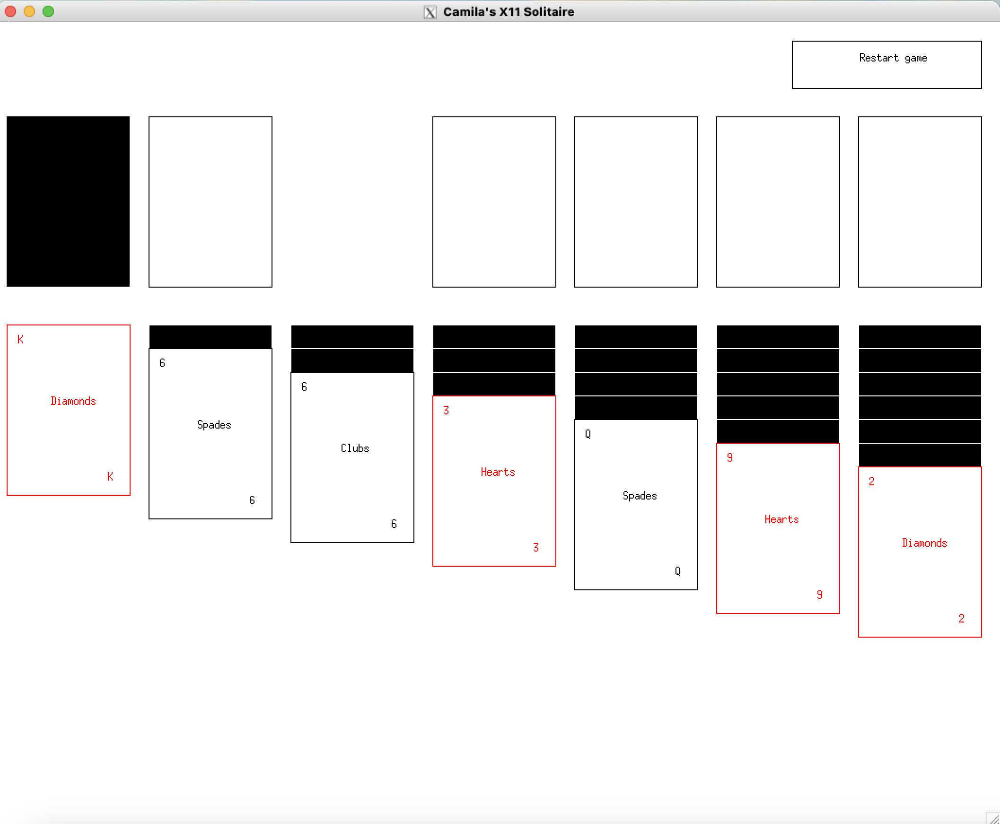
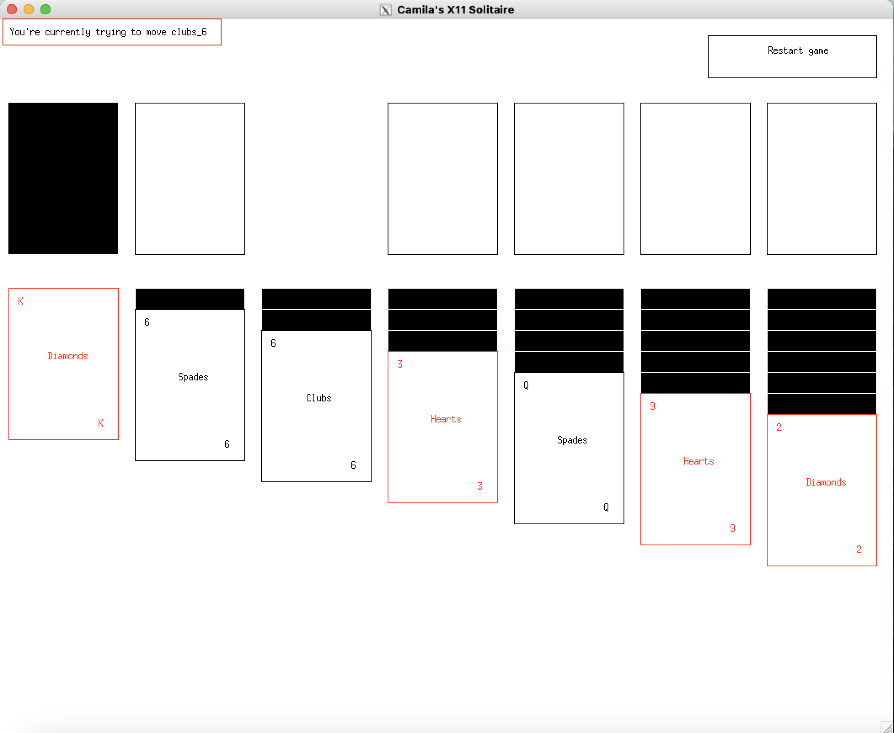
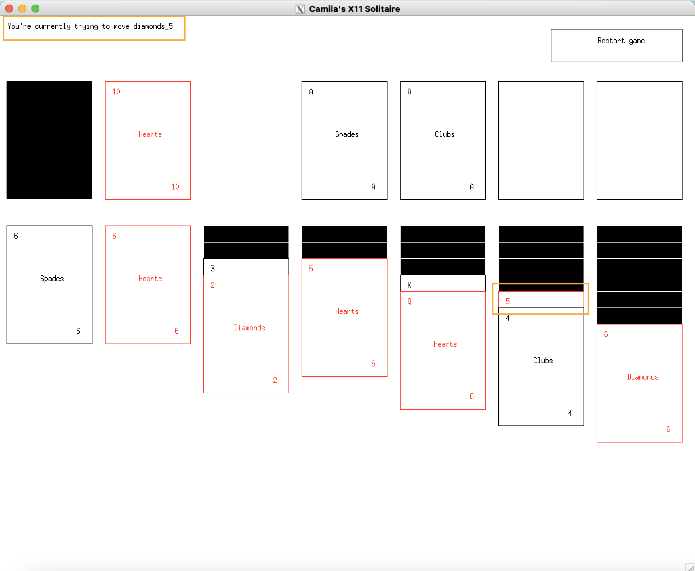
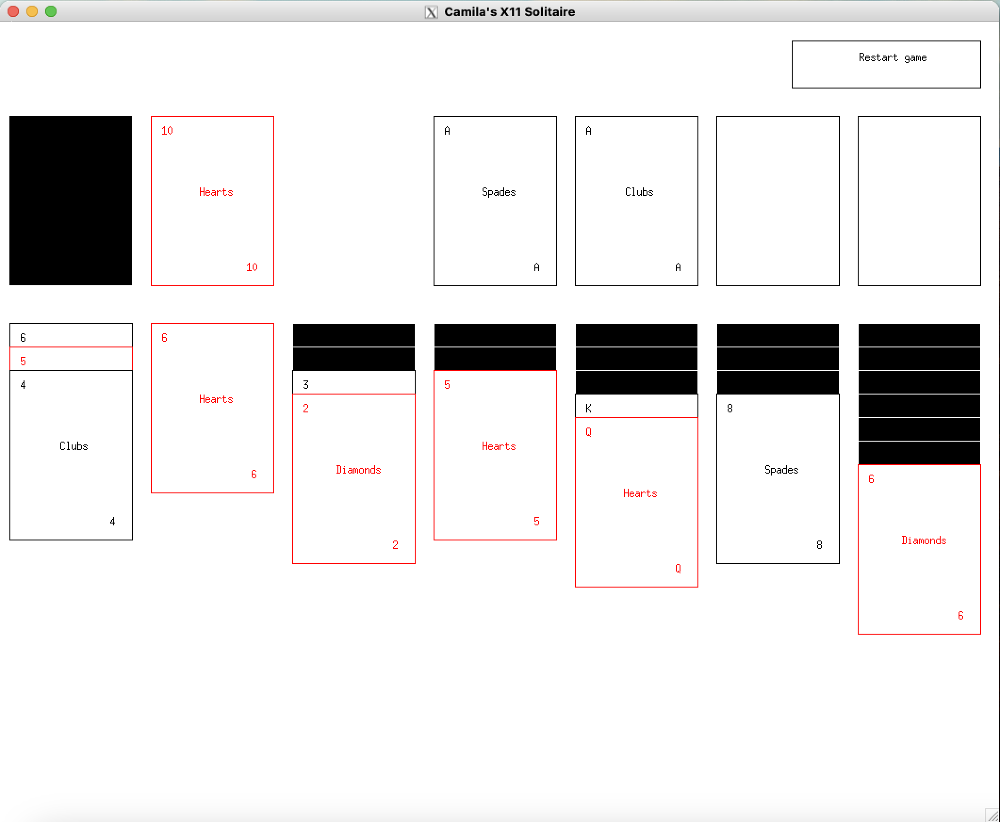
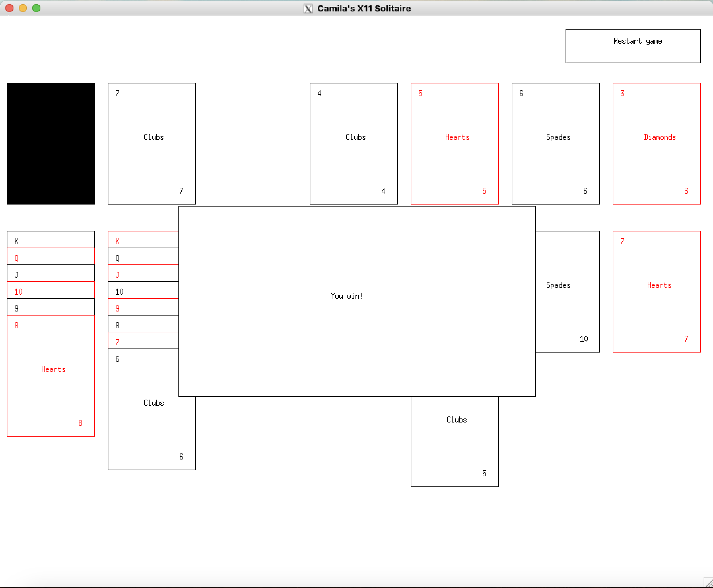

# Solitaire-X11

This is a C++ implementation of Solitaire. It uses X11 to display the game.

## Requirements

* A compiler that supports `C++17`
* `libX11` (in Ubuntu you can install `libx11-dev`)
* `make`
* Tests require [`googletest`](https://github.com/google/googletest)

## Running the tests

It is assumed that `gtest` is installed in one of the default locations, but you can use another by modifying the environment variables `GTEST_INC` and `GTEST_LD`.

You can run the tests as shown below:

```bash
cd tests
GTEST_INC=/usr/local/include GTEST_LD=/usr/local/lib make
make run
```

## Running the game

The game requires `libX11` to run. We assume the library is installed in one of the default locations, however, its location may be overridden using `C_FLAGS` and `LD_FLAGS`.

To compile the game:

```bash
C_FLAGS=-I/opt/homebrew/include/ LD_FLAGS=-L/opt/homebrew/lib/ make
```

This will result in an executable named `run_game`. To run the game just execute the file.

```bash
./run_game
```

## Playing the game

Running the game will show you this screen:



To start playing click on any card, this will show the card you picked in the top-right corner.



You can also click on the stockpile. That will reveal one card.
In the next image, you can see that an Ace was revealed and the player clicked on it.


To finish the move just click on a valid location to place the card (following the [basic rules of solitaire](https://bicyclecards.com/how-to-play/solitaire)).


If the move is valid the card will be moved. Otherwise, the current card you're trying to move will be un-selected. You can also un-select a card by clicking on it again.

You can select and move several cards from the columns at once. To do so just click on the card at the top of the set that you want to move. For example, in the following case, we want to move the 5 and 4 to the first column (under the 6 of spades).



To move the cards click on the destination card. In the case of the previous example just click on the 6 of spades.



You win when you manage to reveal all the cards. You'll know because the game will show you a **you win!** message.



A similar message will show if no more cards can be moved, indicating that you lost.

You won't be allowed to perform any more movements after winning/losing. To restart the game you can click the **restart game** button.
You can click it at any time to reset the Tableau.

## License

[MIT](https://choosealicense.com/licenses/mit/)
